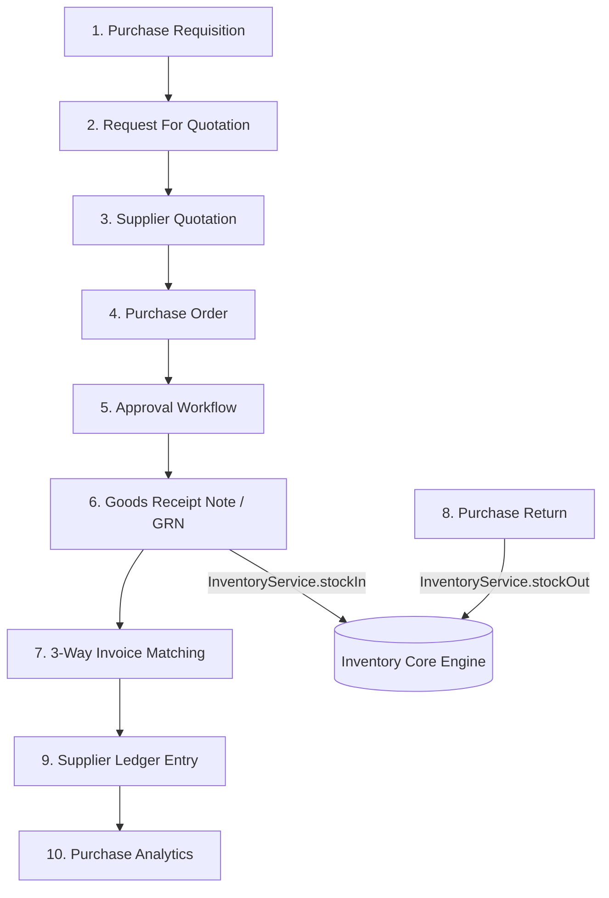

# Enterprise Purchase Module Architectural Specification
## Universal Business Operating System (SaaS ERP Integration)

This document details the architectural design for the Enterprise Purchase Module. This module operates on top of the existing schema and relies strictly on the completed **Inventory Core Engine** for all physical stock modifications.

---



---

## 1. Purchase Requisition
*   **Purpose**: Internal document generated by department heads or warehouse managers requesting procurement of product variants.
*   **State Transitions**: `DRAFT` $\rightarrow$ `PENDING_APPROVAL` $\rightarrow$ `APPROVED` | `REJECTED`.
*   **Database Models**:
    ```prisma
    model PurchaseRequisition {
      id          String   @id @default(uuid())
      userId      String   // Tenant link (references User.email)
      requestorId String   // References User.id
      status      String   @default("DRAFT") // DRAFT, PENDING_APPROVAL, APPROVED, REJECTED
      notes       String?
      items       PurchaseRequisitionItem[]
      createdAt   DateTime @default(now())
      updatedAt   DateTime @updatedAt

      @@index([userId])
    }

    model PurchaseRequisitionItem {
      id            String @id @default(uuid())
      requisitionId String
      requisition   PurchaseRequisition @relation(fields: [requisitionId], references: [id], onDelete: Cascade)
      variantId     String
      quantity      Int
      estimatedCost Float
    }
    ```
*   **Relations**:
    *   `PurchaseRequisition` belongs to `User` (tenant) and Requestor (`User`).
    *   `PurchaseRequisitionItem` references `ProductVariant`.
*   **API Interface**:
    *   `POST /purchases/requisitions`: Create requisition.
    *   `GET /purchases/requisitions/:id`: Get details.
    *   `PATCH /purchases/requisitions/:id/status`: Transition status.
*   **Domain Events**: `RequisitionCreatedEvent`, `RequisitionApprovedEvent`.
*   **Permissions**: `requisition:create` (Warehouse Staff, Department Heads), `requisition:approve` (Department Manager).
*   **Inventory Integration**: None (Read-only reference stage).

---

## 2. Request For Quotation (RFQ)
*   **Purpose**: Document issued to solicit pricing, tax terms, and delivery lead times from multiple candidate suppliers for requisitioned items.
*   **State Transitions**: `DRAFT` $\rightarrow$ `SENT` $\rightarrow$ `RESPONSES_CLOSED` $\rightarrow$ `CLOSED`.
*   **Database Models**:
    ```prisma
    model RequestForQuotation {
      id          String   @id @default(uuid())
      userId      String
      status      String   @default("DRAFT") // DRAFT, SENT, RESPONSES_CLOSED, CLOSED
      expiryDate  DateTime
      items       RFQItem[]
      suppliers   RFQSupplier[]
      quotations  SupplierQuotation[]
      createdAt   DateTime @default(now())
      updatedAt   DateTime @updatedAt

      @@index([userId])
    }

    model RFQItem {
      id        String @id @default(uuid())
      rfqId     String
      rfq       RequestForQuotation @relation(fields: [rfqId], references: [id], onDelete: Cascade)
      variantId String
      quantity  Int
    }

    model RFQSupplier {
      id         String   @id @default(uuid())
      rfqId      String
      rfq        RequestForQuotation @relation(fields: [rfqId], references: [id], onDelete: Cascade)
      supplierId String
      supplier   Supplier @relation(fields: [supplierId], references: [id])
    }
    ```
*   **Relations**:
    *   `RequestForQuotation` maps to `User` (tenant).
    *   `RFQSupplier` links `RequestForQuotation` to `Supplier` (M-to-N).
    *   `RFQItem` references `ProductVariant`.
*   **API Interface**:
    *   `POST /purchases/rfqs`: Initialize RFQ from Requisitions.
    *   `POST /purchases/rfqs/:id/send`: Broadcast RFQ details.
*   **Domain Events**: `RFQCreatedEvent`, `RFQSentEvent`.
*   **Permissions**: `rfq:create` (Procurement Agent), `rfq:send` (Procurement Manager).
*   **Inventory Integration**: None.

---

## 3. Supplier Quotations
*   **Purpose**: Capture formal bid submissions (prices, discounts, shipping terms) returned by suppliers in response to an RFQ.
*   **State Transitions**: `SUBMITTED` $\rightarrow$ `UNDER_REVIEW` $\rightarrow$ `SELECTED` | `REJECTED`.
*   **Database Models**:
    ```prisma
    model SupplierQuotation {
      id         String   @id @default(uuid())
      userId     String
      rfqId      String
      rfq        RequestForQuotation @relation(fields: [rfqId], references: [id])
      supplierId String
      supplier   Supplier @relation(fields: [supplierId], references: [id])
      status     String   @default("SUBMITTED") // SUBMITTED, UNDER_REVIEW, SELECTED, REJECTED
      validUntil DateTime
      subtotal   Float
      tax        Float
      total      Float
      items      SupplierQuotationItem[]
      createdAt  DateTime @default(now())
      updatedAt  DateTime @updatedAt

      @@index([userId])
    }

    model SupplierQuotationItem {
      id          String @id @default(uuid())
      quotationId String
      quotation   SupplierQuotation @relation(fields: [quotationId], references: [id], onDelete: Cascade)
      variantId   String
      quantity    Int
      unitPrice   Float
      taxRate     Float
      total       Float
    }
    ```
*   **Relations**:
    *   `SupplierQuotation` references `RequestForQuotation` and `Supplier`.
    *   `SupplierQuotationItem` references `ProductVariant`.
*   **API Interface**:
    *   `POST /purchases/quotations`: Register supplier bid.
    *   `POST /purchases/quotations/:id/evaluate`: Mark quote selected.
*   **Domain Events**: `QuotationReceivedEvent`, `QuotationSelectedEvent`.
*   **Permissions**: `quotation:submit` (Supplier Portal Key / Staff), `quotation:evaluate` (Procurement Manager).
*   **Inventory Integration**: None.

---

## 4. Purchase Order (PO)
*   **Purpose**: Binding contract committing to purchase goods under defined terms, quantities, and delivery warehouse targets.
*   **State Transitions**: `DRAFT` $\rightarrow$ `PENDING_APPROVAL` $\rightarrow$ `APPROVED` $\rightarrow$ `SENT_TO_SUPPLIER` $\rightarrow$ `PARTIALLY_RECEIVED` $\rightarrow$ `RECEIVED` $\rightarrow$ `CANCELLED`.
*   **Database Models**: Integrates with the existing `PurchaseOrder` and `PurchaseOrderItem` models.
*   **Relations**:
    *   `PurchaseOrder` links `User` (tenant), `Supplier`, and `Warehouse`.
    *   `PurchaseOrderItem` references `ProductVariant`.
*   **API Interface**:
    *   `POST /purchases/orders`: Generate PO (typically converted from a selected `SupplierQuotation`).
    *   `GET /purchases/orders/:id`: Fetch order summary.
*   **Domain Events**: `PurchaseOrderCreatedEvent`, `PurchaseOrderSentEvent`.
*   **Permissions**: `purchase-order:create` (Procurement Agent), `purchase-order:update` (Procurement Agent).
*   **Inventory Integration**: None (PO does not represent physical material arrival).

---

## 5. Purchase Approval Workflow
*   **Purpose**: Multi-level authority rule execution based on purchase limits (e.g. POs over $5,000 require Department Head approval, over $50,000 require CFO approval).
*   **State Transitions**: `PENDING_L1` $\rightarrow$ `PENDING_L2` $\rightarrow$ `APPROVED` | `REJECTED`.
*   **Database Models**:
    ```prisma
    model PurchaseApprovalRule {
      id           String @id @default(uuid())
      userId       String
      minLimit     Float
      maxLimit     Float
      approverRole String // e.g. "DEPARTMENT_HEAD", "CFO", "CEO"
    }

    model PurchaseApprovalLog {
      id        String   @id @default(uuid())
      poId      String
      approverId String  // References User.id
      action    String   // "APPROVED" | "REJECTED"
      level     Int      // Approval level (1, 2, etc.)
      comments  String?
      createdAt DateTime @default(now())
    }
    ```
*   **Relations**:
    *   Approval structures link to `PurchaseOrder` and reference `User` actors.
*   **API Interface**:
    *   `GET /purchases/approvals/pending`: List pending authorizations.
    *   `POST /purchases/approvals/:id/decide`: Approve/reject action.
*   **Domain Events**: `ApprovalRequestedEvent`, `ApprovalApprovedEvent`.
*   **Permissions**: `purchase:approve` (Assigned Role: CFO, Dept Head, etc.).
*   **Inventory Integration**: None.

---

## 6. Goods Receipt Note (GRN) / Purchase Receive
*   **Purpose**: Registers physical goods delivery at the warehouse, verifying matching item quantities, lot codes, and expiry dates.
*   **State Transitions**: `PENDING` $\rightarrow$ `COMPLETED`.
*   **Database Models**: Integrates with the existing `PurchaseReceive` and `PurchaseReceiveItem` models.
*   **Relations**:
    *   `PurchaseReceive` references `PurchaseOrder` and receiving `User`.
    *   `PurchaseReceiveItem` references `ProductVariant` and receiving details.
*   **API Interface**:
    *   `POST /purchases/receives`: Register shipment receipt.
*   **Domain Events**: `PurchaseReceiveCompletedEvent`.
*   **Permissions**: `purchase-receive:create` (Warehouse Clerk / Receiver).
*   **Inventory Integration (CRITICAL)**:
    *   **NEVER** modify `ProductBatch` quantities directly from the GRN module.
    *   For every item received, the GRN logic calls `InventoryService.stockIn()` inside a safe transaction context:
        ```typescript
        const result = await this.inventoryService.stockIn({
          variantId: item.variantId,
          warehouseId: po.warehouseId,
          storageLocationId: item.locationId,
          batchNumber: item.batchNumber,
          quantity: item.quantityReceived,
          purchasePrice: item.purchasePrice,
          mrp: item.mrp,
          operatorName: receive.receivedBy,
          referenceId: receive.id,
          notes: `GRN Receipt from Supplier: ${po.supplierId}`,
        });
        ```

---

## 7. Three-Way Invoice Matching
*   **Purpose**: Financial audit comparing quantities/prices of the Invoice against PO rules and GRN receipts to block unauthorized spend.
*   **State Transitions**: `UNMATCHED` $\rightarrow$ `MATCHED` | `DISCREPANT` $\rightarrow$ `APPROVED_FOR_PAYMENT`.
*   **Database Models**:
    ```prisma
    model SupplierInvoice {
      id          String   @id @default(uuid())
      userId      String
      supplierId  String
      supplier    Supplier @relation(fields: [supplierId], references: [id])
      poId        String
      invoiceNo   String   @unique
      invoiceDate DateTime
      amount      Float
      status      String   @default("UNMATCHED") // UNMATCHED, MATCHED, DISCREPANT, APPROVED
      items       SupplierInvoiceItem[]
      createdAt   DateTime @default(now())
      updatedAt   DateTime @updatedAt

      @@index([userId])
    }

    model SupplierInvoiceItem {
      id        String @id @default(uuid())
      invoiceId String
      invoice   SupplierInvoice @relation(fields: [invoiceId], references: [id], onDelete: Cascade)
      variantId String
      quantity  Int
      unitPrice Float
      total     Float
    }

    model ThreeWayMatchLog {
      id        String   @id @default(uuid())
      invoiceId String
      poMatched Boolean
      grnMatched Boolean
      difference Float
      comments  String?
      runAt     DateTime @default(now())
    }
    ```
*   **Relations**:
    *   `SupplierInvoice` links `Supplier` and references `PurchaseOrder`.
    *   `SupplierInvoiceItem` references `ProductVariant`.
*   **API Interface**:
    *   `POST /purchases/invoices`: Record vendor invoice.
    *   `POST /purchases/invoices/:id/match`: Execute 3-way matching algorithm.
*   **Domain Events**: `InvoiceMatchedEvent`, `InvoiceDiscrepancyLoggedEvent`.
*   **Permissions**: `invoice:create` (Accounts Payable), `invoice:approve` (Accounting Controller).
*   **Inventory Integration**: None.

---

## 8. Purchase Return
*   **Purpose**: Manage returned materials (due to QA reject, damage, or expiry) back to the supplier for credit notes.
*   **State Transitions**: `DRAFT` $\rightarrow$ `APPROVED` $\rightarrow$ `SHIPPED` $\rightarrow$ `COMPLETED`.
*   **Database Models**:
    ```prisma
    model PurchaseReturn {
      id          String   @id @default(uuid())
      userId      String
      supplierId  String
      supplier    Supplier @relation(fields: [supplierId], references: [id])
      warehouseId String
      warehouse   Warehouse @relation(fields: [warehouseId], references: [id])
      status      String   @default("DRAFT") // DRAFT, APPROVED, SHIPPED, COMPLETED
      reasonCode  String
      items       PurchaseReturnItem[]
      createdAt   DateTime @default(now())
      updatedAt   DateTime @updatedAt

      @@index([userId])
    }

    model PurchaseReturnItem {
      id        String @id @default(uuid())
      returnId  String
      return    PurchaseReturn @relation(fields: [returnId], references: [id], onDelete: Cascade)
      variantId String
      quantity  Int
    }
    ```
*   **Relations**:
    *   `PurchaseReturn` references `Supplier` and source shipping `Warehouse`.
    *   `PurchaseReturnItem` references `ProductVariant`.
*   **API Interface**:
    *   `POST /purchases/returns`: Create return request.
*   **Domain Events**: `PurchaseReturnCompletedEvent`.
*   **Permissions**: `purchase-return:create` (QA Manager / Warehouse Clerk).
*   **Inventory Integration (CRITICAL)**:
    *   Upon shipping returns, the engine calls `InventoryService.stockOut()` to deduct quantities:
        ```typescript
        const result = await this.inventoryService.stockOut({
          userId: purchaseReturn.userId,
          variantId: item.variantId,
          warehouseId: purchaseReturn.warehouseId,
          quantity: item.quantity,
          operatorName: 'QA Return System',
          referenceId: purchaseReturn.id,
          notes: `Return to supplier: ${purchaseReturn.supplierId}. Reason: ${purchaseReturn.reasonCode}`,
        });
        ```

---

## 9. Supplier Ledger (Accounts Payable)
*   **Purpose**: Immutable financial ledger cards recording all outstanding vendor liabilities, payments, and invoice charges.
*   **State Transitions**: Posted entries are immutable.
*   **Database Models**:
    ```prisma
    model SupplierLedgerEntry {
      id            String   @id @default(uuid())
      userId        String
      supplierId    String
      supplier      Supplier @relation(fields: [supplierId], references: [id])
      entryType     String   // "INVOICE" | "PAYMENT" | "CREDIT_NOTE"
      invoiceId     String?
      returnId      String?
      debit         Float    @default(0.0) // Reductions in liability (Payments, Returns)
      credit        Float    @default(0.0) // Increments in liability (Invoices)
      balance       Float    // Running outstanding balance
      postedAt      DateTime @default(now())

      @@index([userId])
      @@index([supplierId])
    }
    ```
*   **Relations**:
    *   References `Supplier` and maps optional links to `SupplierInvoice` and `PurchaseReturn`.
*   **API Interface**:
    *   `GET /purchases/suppliers/:id/ledger`: Get supplier ledger history.
*   **Domain Events**: `SupplierLedgerPostedEvent`.
*   **Permissions**: `supplier-ledger:view` (Accounts Payable, Accountant).
*   **Inventory Integration**: None.

---

## 10. Purchase Analytics
*   **Purpose**: Reporting dashboard providing visibility into procurement KPIs (total spend, supplier on-time delivery rates, material lead times, and QA reject metrics).
*   **State Transitions**: Read-only aggregated analytical stage.
*   **Database Models**: No new tables. Operates via optimized analytical query aggregations over `PurchaseOrder`, `PurchaseReceive`, and `SupplierLedgerEntry`.
*   **API Interface**:
    *   `GET /purchases/analytics/summary`: Procurement KPI aggregates.
    *   `GET /purchases/analytics/supplier-performance`: Delivery & quality scoring.
*   **Domain Events**: None.
*   **Permissions**: `purchase-analytics:view` (Purchasing Director, CFO).
*   **Inventory Integration**: None.
